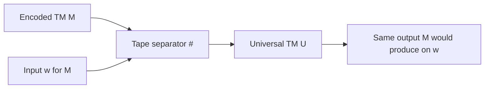
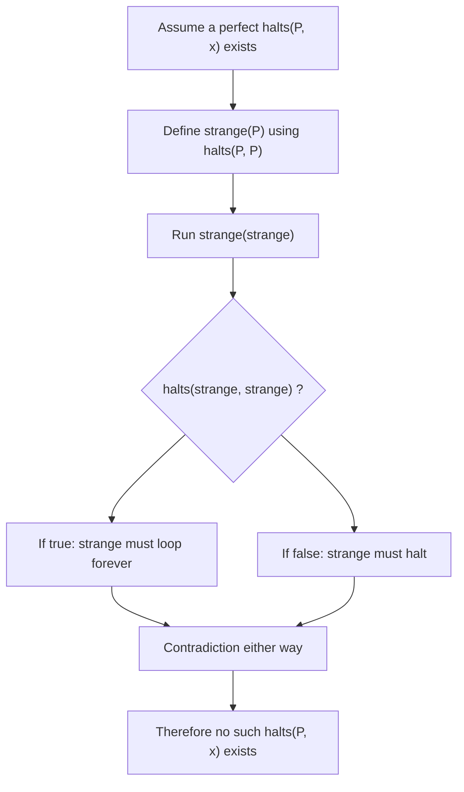
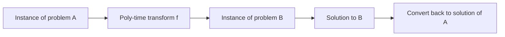
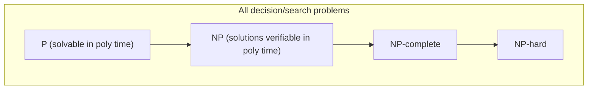

# CS301 - Chapter 5: Theory of Computing (Sections 5.3-5.5)

**Focus:**  
- 5.3 Universality  
- 5.4 Computability  
- 5.5 Intractability and Complexity  

I am using this as a personal "big picture" guide: what all reasonable computers can do, what no computer can ever do, and what is technically solvable but probably not feasible.

---

## 1. Universality (5.3)

### 1.1 Models of computation

A **model of computation** is a mathematically precise way to talk about algorithms. Examples:

- Turing machines  
- Lambda calculus  
- Random access machines  
- Real programming languages like Java, C, Python  

These all describe step by step procedures for transforming input into output.

Key idea: once a model is powerful enough to simulate a Turing machine, it is **Turing complete**. At that point it can compute exactly the same set of functions as any other Turing complete system. Differences are in efficiency, not in what is possible.

---

### 1.2 Turing machines vs real computers

A **Turing machine (TM)** has:

- A finite set of states  
- A read/write head that moves along an infinite tape  
- A transition function that says "given current state and tape symbol, what do I write, which way do I move, and what state do I go to next"

Think of this as a very stripped down CPU plus RAM, with the transition function acting like microcode.

Real computers and languages look more complicated, but they can all be simulated by a Turing machine and can simulate a Turing machine in return.

---

### 1.3 Universal Turing machine (UTM)

A "normal" Turing machine is like a single fixed program: it computes one specific function. A **Universal Turing Machine** is a programmable machine:

- Input:  
  - An encoding of some Turing machine `M`  
  - An input string `w` for `M`  
- The UTM simulates the exact step by step behavior of `M` on `w`.

The tape looks like this:

```text
<description of M> # <input w>
```

where `#` is just a marker symbol.

The UTM is like a VM or interpreter: the first part of the tape is the program, the second part is the data.

#### UTM flow



**Why this matters for me:**

- This is the theoretical basis for the idea of a general purpose computer.  
- "Program" vs "data" is not a hardware distinction, it is a matter of interpretation.  
- Any language that is Turing complete can in principle emulate any other.

---

### 1.4 Church-Turing thesis

The **Church-Turing thesis** is an informal claim, not a theorem:

> Anything that can be computed by a mechanical, step by step procedure can be computed by a Turing machine.

Variants:

- Every "reasonable" programming language can be simulated by a Turing machine and vice versa.  
- Any physically realizable computer can be simulated by a Turing machine, up to efficiency overhead.

For my purposes:

- If there is no Turing machine that solves a problem, then no Java, C, Python, or future computer will either.  
- If there is a Turing machine, then some program can implement that same algorithm.

---

## 2. Computability (5.4)

Now that "algorithm" is formal, we can talk about problems that **no algorithm** can solve.

### 2.1 Decidable vs undecidable

For yes/no questions (decision problems):

- A language `L` is **decidable** (or a problem is decidable) if there exists a Turing machine that:
  - Always halts on every input string
  - Accepts exactly the strings in `L` and rejects the rest

- A language is **recognizable** if there is a TM that:
  - Halts and accepts strings in `L`
  - Might loop forever on strings not in `L`

**Undecidable** means: there is no algorithm that always halts and always gives the correct yes/no answer.

For numeric functions:

- A function `f(x)` is **computable** if some Turing machine, given `x` on its tape, eventually halts with `f(x)` written on the tape.

---

### 2.2 The halting problem

**Problem:**  

> Input: a program `P` and an input `x`.  
> Question: does `P(x)` ever halt, or does it run forever?

We might want a magical method:

```java
// Hypothetical, impossible oracle
static boolean halts(String programSource, String input);
```

that returns true if `programSource` halts on `input`, and false if it loops forever.

Turing proved this cannot exist. The halting problem is **undecidable**.

#### Core proof idea: self reference

Assume (for contradiction) that `halts(P, x)` exists, always halts, and is always correct. Now define this weird program:

```java
// Pseudocode for the diagonal argument
boolean strange(String codeP) {
    if (halts(codeP, codeP)) {
        // If P(P) halts, then this loops forever
        while (true) { }
    } else {
        // If P(P) does not halt, then this halts
        return true;
    }
}
```

Now ask: what happens if we run `strange` on its own source code?

```java
strange("strange");
```

We get a paradox:

- If `halts("strange", "strange")` returns true, strange is supposed to loop forever.  
- If it returns false, strange is supposed to halt.

So in either case `halts` gives the wrong answer. That contradicts our assumption that `halts` exists and is always correct. Therefore such a method cannot exist.

#### Halting problem logic flow



Result: there is no algorithm that can correctly decide halting behavior for all programs and inputs.

---

### 2.3 Busy beaver (a natural uncomputable function)

Imagine all Turing machines with exactly `n` states, starting on a blank tape. Among those machines that eventually halt, look at how many 1s they leave on the tape. The **busy beaver value** `BB(n)` is the maximum possible number of 1s any such machine can leave.

- `BB(1)`, `BB(2)`, `BB(3)` can be computed by brute force for small `n`.  
- For larger `n`, `BB(n)` grows faster than any computable function.

If we could compute `BB(n)` for all `n`, we could also solve halting for many machines by checking whether they exceed the busy beaver bound. Since halting is undecidable, `BB(n)` must be uncomputable too.

Takeaway: there are "naturally defined" uncomputable functions, not just artificial diagonal tricks.

---

### 2.4 Other undecidable problems (names to recognize later)

Many problems are proved undecidable by reducing the halting problem to them. Some classic examples:

- **Program properties:** any nontrivial property of what a program does on its inputs (for example "halts on all inputs" or "prints 'hello' on some input").  
- **Hilbert's tenth problem:** given a polynomial with integer coefficients, is there an integer solution?  
- **Post correspondence problem:** can you arrange given tiles so that top and bottom strings match?

These show undecidability spreads far outside "just" halting.

---

## 3. Intractability and Complexity (5.5)

Now assume a problem is decidable. Next question: is it **feasible**?

### 3.1 Computable vs tractable

- **Computable:** there exists some algorithm that always halts with the right answer.  
- **Tractable:** there exists an algorithm that runs in time that is realistic for the input sizes we care about.

In theory, any algorithm that halts is "fine." In practice, an algorithm that takes 2^N steps is useless once N gets moderately large.

---

### 3.2 Polynomial vs exponential time

Complexity classes use asymptotic time in terms of input size `N`.

- **Polynomial time:** runtime is `N^k` (or `N^k log N`, etc) for some constant `k`.  
- **Superpolynomial / exponential:** runtimes like `2^N`, `N!`, `N^(log N)`, etc.

In complexity theory:

- Polynomial time is considered "efficient" or "tractable".  
- Exponential time is considered "intractable" for large `N`.

Very rough intuition:

- A `N^3` algorithm may be slow, but doubling hardware power helps a lot.  
- A `2^N` or `N!` algorithm will blow up so fast that even a universe full of computers cannot save you for moderate N.

---

### 3.3 Classes P and NP

We mostly care about **decision problems**, but it is often easier to think in terms of **search problems**: find a solution if one exists.

#### P: problems solvable quickly

- `P` is the class of problems that can be solved in polynomial time by a deterministic machine (a "normal" algorithm).  

Examples (roughly corresponding to earlier chapters):

- Sorting an array  
- Checking if a graph has a path between two vertices  
- Solving a system of linear equations with Gaussian elimination

#### NP: problems verifiable quickly

- `NP` is the class of problems where, given a candidate solution, we can **verify** its correctness in polynomial time.

Example: subset sum:

> Input: integers `a1, a2, ..., aN` and a target `T`.  
> Question: is there a subset that sums to `T`?

- If someone hands me a subset (list of indices), I can check in O(N) that they really add to `T`.  
- Finding that subset in the first place by brute force is O(2^N).

Simple Java verification example:

```java
// Verify a claimed subset solution in O(N) time.
static boolean verifySubsetSum(int[] a, boolean[] choose, int target) {
    int sum = 0;
    for (int i = 0; i < a.length; i++) {
        if (choose[i]) sum += a[i];
    }
    return sum == target;
}
```

This shows subset sum is in NP. We do not know a polynomial time algorithm that always finds a solution.

By definition: `P` is a subset of `NP` (if you can find solutions quickly, you can verify them quickly).

---

### 3.4 Extended Church-Turing thesis (efficiency version)

The original Church-Turing thesis is about what is computable. The **extended** version says:

> Any "reasonable" computing model can simulate any other with at most polynomial slowdown.

So, "polynomial time" is robust: if a problem is in P on one reasonable machine model, it is still "feasible" on any other, up to polynomial factors.

This is why complexity theory focuses on polynomial vs exponential rather than specific constant factors or low level details.

---

### 3.5 P vs NP

The famous open problem:

> Is P equal to NP?

- If P = NP: any problem whose solutions can be checked quickly can also be solved quickly.  
- If P ≠ NP: some problems can be checked quickly but not solved quickly.

Most computer scientists strongly believe P ≠ NP, but nobody has proved it. There is a million dollar prize for a correct proof either way.

---

### 3.6 Reductions and NP-completeness

To compare difficulty of problems, we use **reductions**.

**Idea:** problem A reduces to problem B if:

- There is a polynomial time translator `f` that converts any instance of A into an instance of B.  
- Solving B on `f(instance)` gives a solution to the original A instance.

If A reduces to B and B is easy, then A is also easy.



**NP-complete** problems are:

1. In NP, and  
2. Every problem in NP can be reduced to them in polynomial time.

So NP-complete problems are the "hardest" problems in NP. If we find a polynomial time algorithm for one NP-complete problem, then all of NP collapses into P.

Common NP-complete examples (names only, details later in other courses):

- SAT (satisfiability of Boolean formulas)  
- 3-SAT  
- Clique  
- Vertex cover  
- Traveling salesman (decision version)  
- Subset sum, partition, knapsack (various variants)

These show up everywhere: scheduling, routing, puzzle solving, circuit design, bioinformatics, and more.

---

### 3.7 Class relationships at a glance



Facts:

- We know `P ⊆ NP`.  
- We know NP-complete problems are in NP and are NP-hard.  
- We do not know if `P = NP` or if there are problems in NP that are neither in P nor NP-complete.

---

## 4. Quick self check for Future Me

If I can answer these without notes, I probably remember the core of 5.3-5.5:

1. What does it mean for a model of computation to be universal?  
2. How is a Universal Turing Machine like a modern general purpose computer?  
3. Define "decidable language" and "computable function" in my own words.  
4. State the halting problem. Why is it undecidable?  
5. What is the busy beaver function and why is it uncomputable?  
6. What is the practical difference between an O(N^3) algorithm and an O(2^N) algorithm?  
7. Define P and NP. Why is every problem in P also in NP?  
8. What does it mean for a problem to be NP-complete?  
9. What would a polynomial time algorithm for an NP-complete problem imply about P vs NP?

---

## 5. Optional video reminders

If I want quick refreshers:

- **Computability, Universality (MIT OCW)** - maps the math definitions to actual programming intuition.  
- **Turing Complete (Computerphile)** - good on why "Turing completeness" is the magic threshold.  
- **Turing and the Halting Problem (Computerphile)** - walks through the halting paradox.  
- **Are There Problems That Computers Cannot Solve? (Tom Scott)** - gives the big picture of undecidability and uncomputability.
